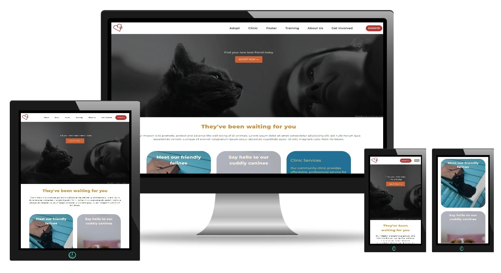
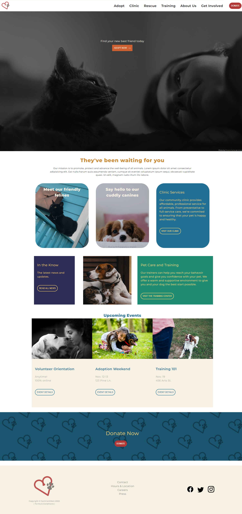

# Pet Adoption Landing Page
A landing page for a fake pet adoption site.\
This page was built in order to practice CSS techniques such as flexbox and responsive design. It looks great on any device. On smaller screens the menu collapses to a hamburger icon and submenus are added. There are hover animations on many of the links and there is a javaScript carousel to display upcoming events. The carousel only works on screens that are too small to display all events.

---

